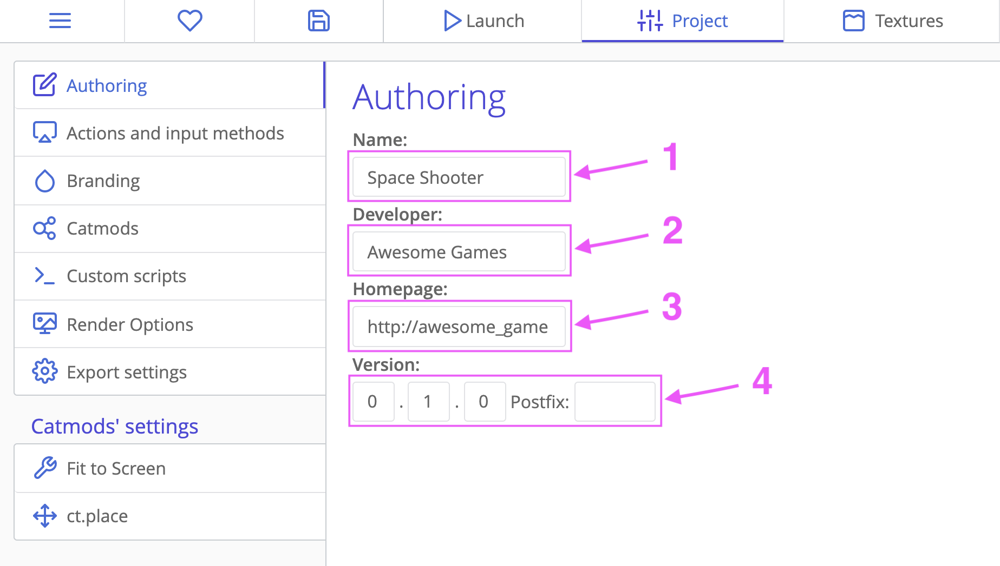
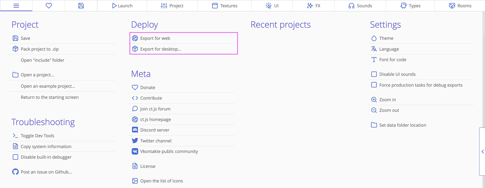
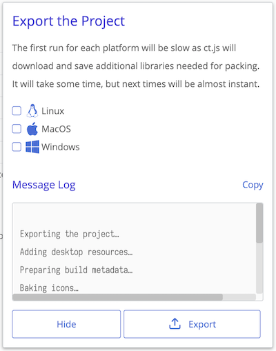

# Building Your Game

So, you have finished developing your game and you are ready to share your masterpiece with the world. This section will show you all that is needed to build and deploy your game.

Here's what we will do:

[[toc]]

## Authoring

Open the `Project` tab and select the `Authoring` side tab, here we can add the authoring details for your project.

1. **Name:** This will be the name of the executable or the .zip file when you export the game.
2. **Developer:** Add the name of the developer here.
3. **Homepage:** The URL to your website goes here.
4. **Version:** Add a version number here to keep track of your game updates and patches.

## Branding

Open the `Project` tab, select the `Branding` side tab, here we have some branding options for the exported project.

1. **Game icon:** Add an icon to your game, you can choose one from any of your imported textures.
2. **Accent:** This changes the accent color of the loading screen.
3. Here you can change whether the accent color affects the background or fill by inverting it. You can also hide the "Made with ct.js" loading screen here.

## Export Settings

In the `Project` tab, select the `Export Settings`side tab.

Here you can find some more advanced settings that will take effect when you export your game. For most projects the defaults will be fine.

## Exporting your game

In the `Main Menu` tab, you will see two export options under the `Deployment` heading.

### Export for web

Exporting for the web is as easy as pressing the button. Once the game is finished exporting, you will be presented with the exported zip file containing your game files.

### Export for desktop

When exporting for Desktop you will need to choose the OS that you want to build an executable for.

Once the game is finished exporting, you will be presented with the resulting folders containing the executable files.

Simply open the folder and run the executable.
